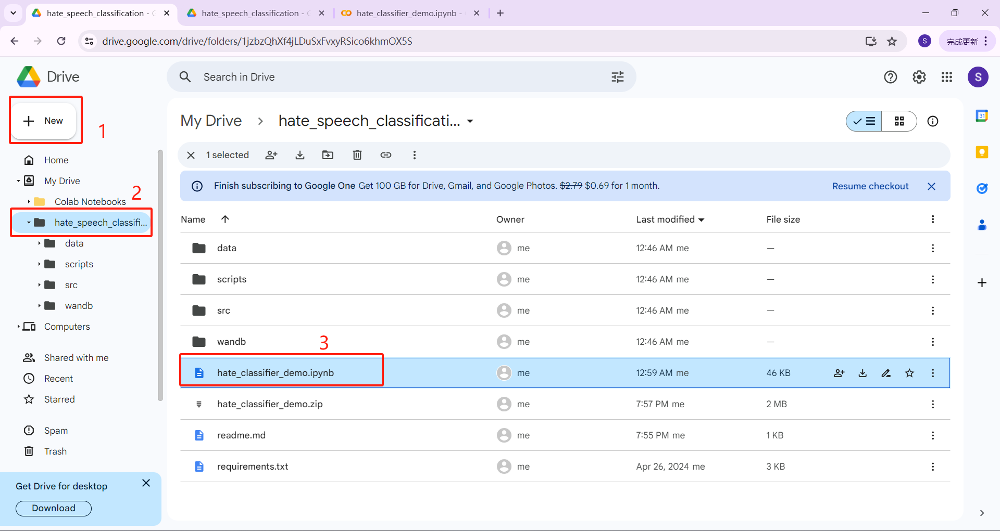
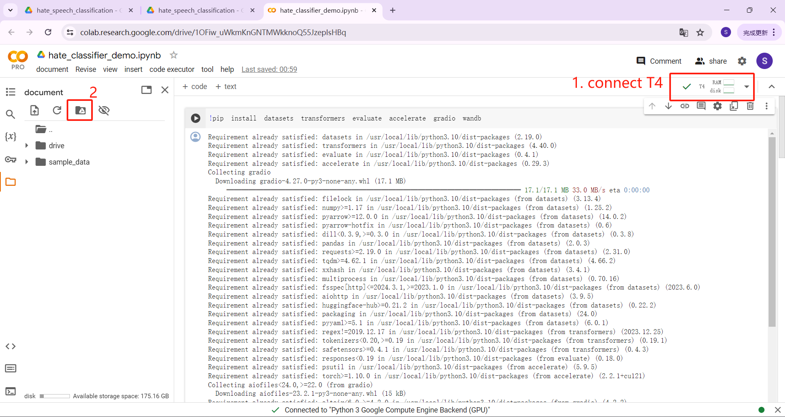
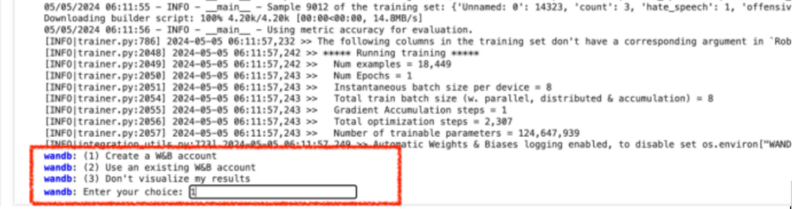
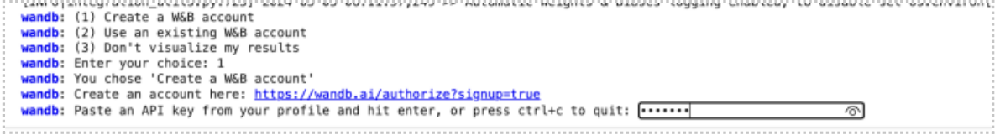

# For Linux

# Prepare python environments

It is recommended to use conda to create a new python environments.
```
conda create -n classifier python==3.10 -y
conda activate classifier
pip install -r requirements.txt
```

# Option 1. Directly run the code without training

### A. If you have no enough computing resources to train the DNN model, you can directly run the code in cmd.

```
bash scripts/deploy_no_train.sh
```

### B. For other system you need to use colab

Finish **File prepare** and **Prepare before run the code** (Specific steps are introduced below)

Then run code and open Public URL:

```
!pip install datasets transformers evaluate accelerate gradio wandb
!bash scripts/deploy_no_train.sh
```

# Option 2. Train the model for better performance with GPU on Colab

### 1. File prepare

You should upload the folder (hate_speech_classification) which include all the file needed to the colab - MyDrive and then open hate_classifier_demo.ipynb



### 2.Prepare before run the code

Connect to T4 GPU and then click Mount Google Drive and Follow the instructions to connect to google drive.



Run the following code to enter the correct running path

```
cd /content/drive/MyDrive/hate_speech_classification
```

### 3.Then run all step by step

During training process of the Bert model, the command shell will prompt you to register wandb account for logging training information: 



You should use input “1” and create your W&B account and input your account API key.




After you finish the W&B API key, the training process and logging program will automatically run. Finally, the trained Bert model will be evaluated and deployed for further usage. 

# Option 3. Train the model for better performance with your own linux computer/server with GPU

## 1. Prepare data
Split your data into training/validation parts.
```
python src/split.py
```


## 2. Training your classifier
Train the bert model on training dataset.
```
bash scripts/train.sh
```

## 3. Evaluate your classifier
Evaluate the trained bert model on validation dataset.
```
bash scripts/eval.sh
```


## 4. Deploy your classifier
```
bash scripts/deploy_after_train.sh
```
